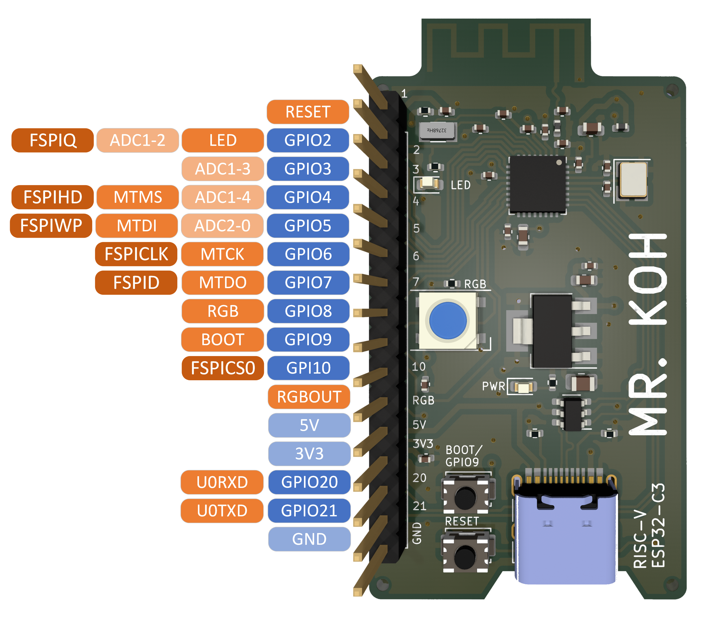
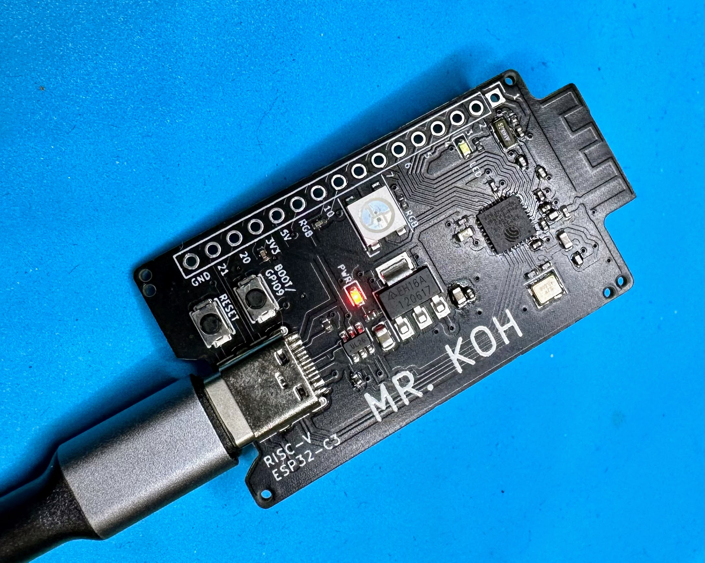

# Mr. Koh Board
Mr. Koh ESP32-C3 RISC-V Development Board

## The Mr. Koh is a birthday project for Mr. Koh.
# Happy Birthday Mr. Koh! 🥳
Mr. Koh is an Open Hardware, Open Source (GPL3.0), ESP32-C3 RISC-V Developement Board.

## Features
* [RISC-V](https://github.com/jameslzhu/riscv-card/blob/586b60b5c351b3e6e6ebbf7130b9f93013b2e511/riscv-card.pdf) instruction set
* [Espressif Systems ESP32-C3FH4 MCU](https://www.espressif.com/en/products/socs/esp32-c3)
* 400K SDRAM and 4MB Flash memory
* Real-Time Clock support
* 10 GPIOs with RESET, BOOT, and RGB OUT
* [RGB](http://www.world-semi.com/Certifications/details-111-4.html), power and data leds
* Built-in USB Type C flashing and [JTAG debugging](https://docs.espressif.com/projects/esp-idf/en/latest/esp32c3/api-guides/usb-serial-jtag-console.html)
* ESD protected
* [FreeRTOS](https://www.freertos.org/Using-FreeRTOS-on-RISC-V.html) Supported when using [ESP-IDF](https://docs.espressif.com/projects/esp-idf/en/v5.0/esp32/)

## Pinout

## Files
* [Datasheet](https://www.espressif.com/sites/default/files/documentation/esp32-c3_datasheet_en.pdf)
* [Schematic](Schematic.pdf) 
* [BOM](Hardware/Fab/MrKohBOM.csv)
* [CPL (Position)](Hardware/Fab/MrKoh-top-pos.csv)
* [PCB Front](MrKoh.png)
* [PCB Back](MrKohBack.png)

## History
1. v1 Designed 01/23/2023.
2. v1 Sent to production 01/26/2023.
3. v1 Shipped 01/30/2023.
4. v1 Arrival 02/03/2023.
5. v1 Issues with USB Type C connector clearance and USB Type C pinout resulting in connectivity problems.
6. v1 LED was on all the time.
7. Rev 2 Carved out a space for the Type C connector and redid the PCB for correct pinout.
8. Rev 2 Removed Q1 and pull up, Pin GPIO2 is now just an LED.  Reworked PCB to remove Q1 and R7. 
9. Rev 2 Reworked the Pin Header pins to allow 5V from USB and to use that pin in place of USB.
10. Rev 2 Sent to production 02/06/2023, Shenzhen, Guangdong, China Time (UTC+8).
11. Rev 2 pcb finished 02/07/2023
12. Rev 2 assembly finished 2023-02-08 06:37:05 (local time).
13. Rev 2 waiting for Carrier to pick up completed boards.
14. Rev 2 delivered on Mon Feb 13 at 16:43
15. Rev 2 Tests indicate board is fully functional.

## Photo

