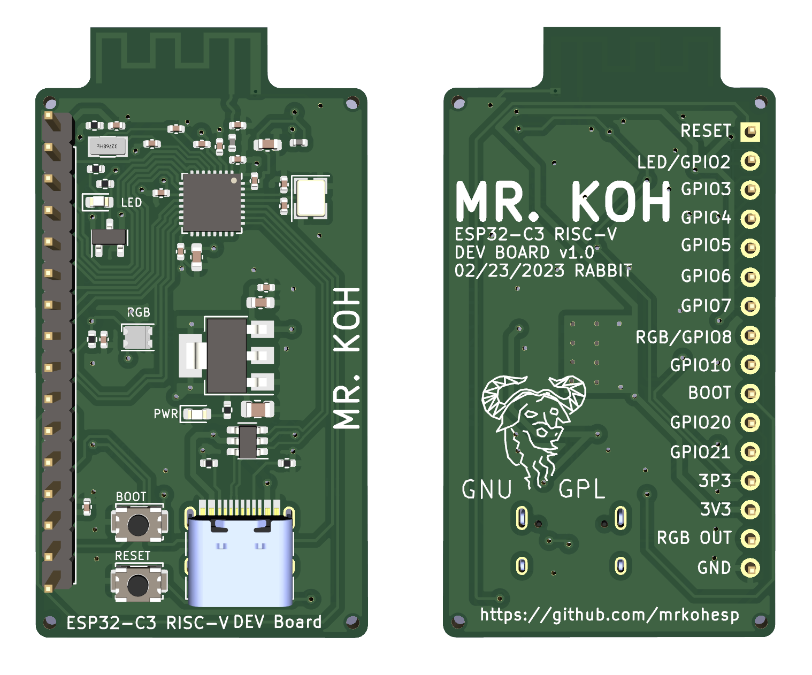

# Mr. Koh Board
Mr. Koh ESP32-C3 RISC-V Development Board

The Mr. Koh is a birthday project for Mr. Koh.  Happy Birthday Mr. Koh!  Mr. Koh is an Open Hardware, Open Source (GPL3.0), ESP32-C3 RISC-V Developement Board.

## Features
* [RISC-V](https://github.com/jameslzhu/riscv-card/blob/586b60b5c351b3e6e6ebbf7130b9f93013b2e511/riscv-card.pdf) instruction set
* [Espressif Systems ESP32-C3FH4 MCU](https://www.espressif.com/en/products/socs/esp32-c3)
* 400K SDRAM and 4MB Flash memory
* Real-Time Clock support
* 10 GPIOs with RESET, BOOT, and RGB OUT
* RGB, power and data leds
* Built-in USB Type C flashing and debugging
* ESD protected

## Files
* [Datasheet](https://www.espressif.com/sites/default/files/documentation/esp32-c3_datasheet_en.pdf)
* [Schematic](Hardware/MrKoh.pdf) 
* [PCB Front](front012623.png)
* [PCB Back](back012623.png)

## History
1. Designed 01/23/2023
2. Sent to production 01/26/2023

